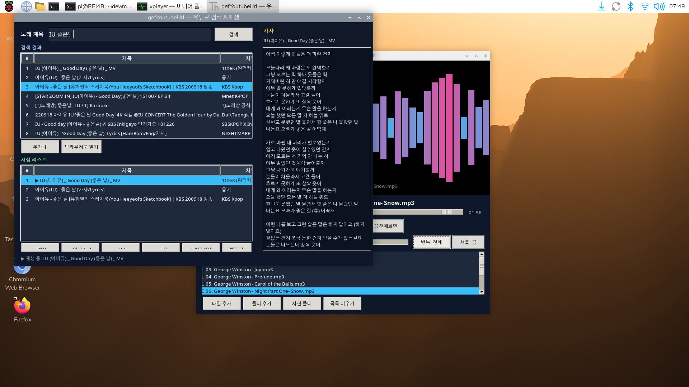

# getYoutubeUrl — 유튜브 노래 검색 · 재생 · MP3 저장

Python3 + tkinter + yt-dlp + libVLC 로 만든 GUI 프로그램입니다.
노래 제목으로 유튜브를 검색하고, 원하는 곡을 **재생 리스트**에 담아
**재생**, **가사 표시**, **MP3·MV(1080p MP4) 다운로드**까지 한 창에서 처리합니다.
**노래 검색**과 **뮤직비디오 검색**을 구분할 수 있으며, MV는 **800×600 팝업**에서 **Full HD(1080p)** 로 재생합니다.
(유튜브 API 키 불필요)



---

## 목차

- [주요 기능](#주요-기능)
- [개발 환경](#개발-환경)
- [의존성 패키지](#의존성-패키지)
- [설치 및 실행](#설치-및-실행)
- [화면 구성 & 버튼별 기능](#화면-구성--버튼별-기능)
- [단축키](#단축키)
- [프로젝트 구성](#프로젝트-구성)
- [동작 원리](#동작-원리)
- [변경 이력](#변경-이력)
- [참고](#참고)

---

## 주요 기능

- **🎵 노래 검색** / **🎬 뮤직비디오** 검색 모드 선택 (기본 20개, 최대 200개)
- 검색 결과·재생 리스트에 **구분** 표시 (`🎵 노래` / `🎬 MV`)
- 검색 결과를 재생 리스트에 **무제한 누적** 추가 (여러 번 검색 가능, 중복 방지)
- **노래**: 메인 창에서 오디오 스트리밍 재생 (libVLC)
- **뮤직비디오**: 별도 **팝업 창**(초기 800×600)에서 **Full HD(1080p)** 영상 재생, F11 전체화면
- 오른쪽 패널에 **가사** 표시 (syncedlyrics)
- 재생 리스트 곡 **MP3(192kbps) 일괄·선택 저장**
- 재생 리스트 MV **MP4(1080p) 일괄·선택 저장**
- **랜덤 재생** 및 곡 종료 후 자동 다음 곡
- **Linux / macOS / Windows** 설치·실행 스크립트 제공
- 검색·재생·가사·다운로드·MV 로딩은 **백그라운드 스레드** 처리 (GUI 멈춤 방지)

---

## 개발 환경

### Raspberry Pi (기본 개발·테스트 환경)

| 항목 | 내용 |
|------|------|
| 기기 | Raspberry Pi (aarch64 / arm64) |
| OS | Debian GNU/Linux 13 (trixie) |
| 데스크톱 | Wayland (labwc) + XWayland |
| 언어 | Python 3.13.5 |
| GUI | tkinter (`python3-tk`) |
| 미디어 백엔드 | libVLC 3.0.23 "Vetinari" |
| 가상환경 | `venv` (프로젝트 내 `.venv/`) |
| 초기 창 크기 | 1240×820 (최소 1000×720) |

> tkinter 창은 XWayland 디스플레이(`:0`)를 사용합니다. `run.sh` 가 `DISPLAY`·`XAUTHORITY` 를 자동 설정합니다.

### macOS / Windows

| OS | Python | VLC | ffmpeg | 설치 스크립트 |
|----|--------|-----|--------|---------------|
| macOS | uv + Python 3.11 | `~/Applications/VLC.app` | `~/.local/bin/ffmpeg` | `setup-mac.sh` |
| Windows | Python 3.12 (tkinter) | VideoLAN VLC | `%LOCALAPPDATA%\getYoutubeUrl\bin` | `setup-windows.bat` / `setup-windows-manual.bat` |

---

## 의존성 패키지

### 시스템 패키지 (apt)

| 패키지 | 용도 |
|--------|------|
| `python3` | 런타임 |
| `python3-tk` | tkinter GUI |
| `libvlc5` / `vlc-bin` | libVLC (재생) |
| `ffmpeg` | MP3 변환 (다운로드 시) |

### 파이썬 패키지 (가상환경)

| 패키지 | 버전 (예) | 용도 |
|--------|-----------|------|
| `yt-dlp` | 2026.3.17 | 유튜브 검색·스트림·다운로드 |
| `python-vlc` | 3.0.21203 | libVLC 파이썬 바인딩 (재생) |
| `syncedlyrics` | 1.0.1 | 가사 검색 (lrclib 등) |

> `syncedlyrics` 가 없으면 가사 기능만 비활성화되고 나머지는 동작합니다.

---

## 설치 및 실행

### Linux (Raspberry Pi 등)

#### 1) 가상환경·의존성 설치

```bash
cd ~/dev/getYoutubeUrl
python3 -m venv .venv
.venv/bin/pip install -U pip -r requirements.txt
sudo apt install -y python3-tk vlc ffmpeg
```

#### 2) 스크립트로 실행

```bash
~/dev/getYoutubeUrl/run.sh
```

#### 3) 직접 실행

```bash
cd ~/dev/getYoutubeUrl
DISPLAY=:0 ./.venv/bin/python getYoutubeUrl.py
```

#### 4) 백그라운드 실행 (서버·SSH)

```bash
cd ~/dev/getYoutubeUrl
DISPLAY=:0 XAUTHORITY=$HOME/.Xauthority nohup ./run.sh >> /tmp/getYoutubeUrl.log 2>&1 &
```

#### 5) 종료

```bash
pkill -f getYoutubeUrl.py
```

### macOS

```bash
cd ~/dev/getYoutubeUrl
./setup-mac.sh    # uv, Python, VLC, ffmpeg, .venv 설치
./run.sh          # 실행
```

### Windows

| 스크립트 | 용도 |
|----------|------|
| `setup-windows.bat` | Windows 환경 구축 (winget 사용, **없으면 수동 설치로 자동 전환**) |
| `setup-windows-manual.bat` | winget 없이 python.org / VideoLAN / gyan.dev 에서 직접 설치 |
| `run-windows.bat` | 프로그램 실행 (`run-windows.ps1` 호출) |
| `run-windows.ps1` | 실제 실행 로직 (`.venv`, VLC·ffmpeg PATH) |
| `fix-run-windows.bat` | 실행 실패 시 진단·자동 복구 후 실행 |

```text
1. setup-windows.bat  더블클릭  (winget 없어도 자동으로 수동 설치 전환)
2. run-windows.bat    더블클릭
```

실행·설치가 안 되면 `fix-run-windows.bat` 을 실행하세요.

> **Windows 배치 파일 주의:** `.bat` 파일에 **한글 echo** 또는 **LF 줄바꿈**이 있으면 cmd가 명령을 깨뜨릴 수 있습니다.  
> 본 프로젝트의 `.bat` 은 **ASCII + CRLF** 래퍼만 두고, 실제 작업은 `.ps1` 이 처리합니다.  
> `setup-windows.bat` 은 winget이 없을 때 `setup-windows-manual.ps1` 로 자동 전환합니다.

> **인터넷 연결**이 필요합니다 (검색·재생·다운로드·가사).

---

## 화면 구성 & 버튼별 기능

화면은 **왼쪽**(검색·리스트·컨트롤)과 **오른쪽**(가사 패널 320px)으로 나뉩니다.
맨 아래 **상태줄**에 진행·오류 메시지가 표시됩니다.

### 상단 — 검색 종류·검색어

| UI | 기능 |
|----|------|
| **🎵 노래 검색** | 일반 곡 위주 검색 (MV 제목은 우선 제외, 부족 시 포함) |
| **🎬 뮤직비디오** | `검색어 + official mv` 로 검색, MV 제목 우선 필터 |
| **검색어** 입력란 | 곡명·가수명 입력 |
| **개수** (Spinbox) | 유튜브에서 가져올 결과 수 (기본 20, 1~200) |
| **검색** | 선택한 모드로 유튜브 검색 (백그라운드). `Enter` 키와 동일 |

### 검색 결과 영역

| 컬럼 | 설명 |
|------|------|
| # | 순번 |
| 구분 | `🎵 노래` 또는 `🎬 MV` |
| 제목 | 영상 제목 |
| 채널 | 업로더 |
| 길이 | 재생 시간 |

| 버튼 / 동작 | 기능 |
|-------------|------|
| **추가 ↓** | 선택 항목(노래·MV)을 재생 리스트에 추가 (URL 중복 시 건너뜀) |
| **🎬 MV 재생** | 선택 항목을 **MV 팝업**에서 재생 (800×600, Full HD) |
| **브라우저로 열기** | 선택한 영상을 기본 웹 브라우저에서 열기 |
| 결과 **더블클릭** | `🎵 노래` → 리스트 추가 / `🎬 MV` → MV 팝업 재생 |

### 재생 리스트 영역

| 컬럼 | 설명 |
|------|------|
| # | 순번 |
| 구분 | `🎵 노래` 또는 `🎬 MV` |
| 제목 | `▶` 표시 = 현재 재생·선택 중인 곡 |
| 채널 | 업로더 |
| 길이 | 재생 시간 |

| 버튼 / 동작 | 기능 |
|-------------|------|
| **⬇ MP3 다운로드 (전체)** | 재생 리스트 **전체** 곡을 폴더에 MP3(192kbps)로 저장 |
| **⬇ 선택 곡 저장** | 리스트에서 **선택한 곡 한 곡**만 MP3로 저장 |
| **⬇ 선택 MV 저장** | 리스트에서 **선택한 MV 한 개**를 MP4(1080p)로 저장 |
| **⬇ MV 저장 (전체)** | 리스트에 있는 **모든 MV**를 MP4(1080p)로 일괄 저장 |
| 항목 **더블클릭** | `🎵 노래` → 오디오 재생 / `🎬 MV` → MV 팝업 재생 |

저장 시 폴더 선택 다이얼로그가 뜨고, 상태줄에 `MP3/MV 저장 중 (i/N)` 진행이 표시됩니다.  
MV 저장에는 **ffmpeg** 가 필요합니다 (MP3 저장과 동일).

### 재생 컨트롤

| 버튼 | 기능 |
|------|------|
| **▶ 재생** | 선택 곡 재생 (`🎵` 오디오 / `🎬` MV 팝업). 선택 없으면 첫 곡 |
| **⏸ 일시정지** | 재생 ↔ 일시정지 토글 |
| **⏹ 정지** | 재생 정지 |
| **⏭ 다음** | 다음 곡 재생 (`랜덤: 켬` 이면 무작위) |
| **🔀 랜덤재생** | 랜덤 모드를 켜고 리스트에서 **무작위 곡 즉시 재생** |
| **랜덤: 끔/켬** | 켜두면 `⏭ 다음`·곡 종료 후 자동 넘김이 **무작위** |
| **🗑 삭제** | 선택 곡을 리스트에서 제거 (재생 중이면 정지·인덱스 보정) |
| **🗑 전체삭제** | 리스트 전체 비우기·재생 정지 |
| **전체 URL 복사** | 재생 리스트의 URL을 줄바꿈으로 클립보드에 복사 |

### 오른쪽 — 가사 패널

| UI | 기능 |
|----|------|
| **가사** 영역 | 현재 재생 곡의 가사 표시 (스크롤 가능) |
| (자동) | 곡 재생 시 `syncedlyrics` 로 가사 조회. 제목 괄호·`Official MV` 등 제거 후 검색 |

### MV 팝업 창 (뮤직비디오 재생)

| UI / 키 | 기능 |
|---------|------|
| 초기 크기 | **800×600** (최소 640×480) |
| 영상 해상도 | **Full HD (1080p 이하)** — `best[height<=1080]` 우선 |
| **⛶ 전체화면 (F11)** / 영상 더블클릭 | 전체화면 토글 |
| **Esc** | 전체화면이면 해제, 일반 창이면 팝업 닫기 |
| **닫기** | 팝업 종료·재생 정지 |
| (자동) | MV 재생 시 메인 창 오디오 재생은 정지 |

### 하단 — 상태줄

검색·재생·저장·삭제·MV 로딩 등 작업 결과와 오류 메시지를 표시합니다.

---

## 단축키

| 키 | 동작 | 적용 |
|----|------|------|
| `Enter` | 검색 실행 | 메인 창 |
| `F11` | 전체화면 토글 | MV 팝업 |
| `Esc` | 전체화면 해제 또는 팝업 닫기 | MV 팝업 |

---

## 프로젝트 구성

| 파일 / 폴더 | 설명 |
|-------------|------|
| `getYoutubeUrl.py` | 프로그램 본체 (tkinter GUI) |
| `requirements.txt` | Python 패키지 목록 |
| `run.sh` | Linux/macOS 실행 (`DISPLAY`·VLC PATH) |
| `setup-mac.sh` | macOS 환경 자동 구축 (uv, VLC, ffmpeg) |
| `setup-windows.bat` / `setup-windows.ps1` | Windows 환경 구축 (winget, 없으면 manual 자동 전환) |
| `setup-windows-manual.bat` / `setup-windows-manual.ps1` | Windows 수동 구축 (winget 불필요) |
| `run-windows.bat` / `run-windows.ps1` | Windows 실행 (bat→ps1) |
| `fix-run-windows.bat` / `fix-run-windows.ps1` | Windows 실행 문제 진단·자동 복구 |
| `README.md` | 본 문서 |
| `README.qiita.md` | Qiita 게시용 문서 (한글) |
| `screenshot.png` | 실행 화면 캡처 |
| `.venv/` | 가상환경 (yt-dlp, python-vlc, syncedlyrics) |

---

## 동작 원리

### 검색

- **노래 모드:** `ytsearch{N}:검색어` — MV 제목(`Official MV`, `뮤직비디오` 등) 우선 제외
- **뮤직비디오 모드:** `ytsearch{N}:검색어 official mv` — MV 제목 우선, 부족 시 보충
- `extract_flat` 으로 메타데이터만 추출 → 구분·제목·채널·길이·URL·`media_type` 저장

### 재생 리스트

- `list[dict]` 로 메모리에 보관 (곡 수 **제한 없음**)
- 여러 번 검색해도 리스트 유지, URL 기준 중복 방지

### 재생 (노래 · 오디오)

1. `yt-dlp` 로 **오디오 스트림 URL** 추출 (`bestaudio/best`)
2. 메인 창 `libVLC` `media_player` 로 스트리밍 재생

### 재생 (뮤직비디오 · MV 팝업)

1. `MvPlayerWindow` 팝업 생성 (초기 **800×600**)
2. `yt-dlp` 로 **1080p 이하** 영상 스트림 URL 추출 (`best[height<=1080]` 우선)
3. 별도 VLC 플레이어로 `video_panel` 에 임베드 (`set_xwindow`)
4. UI 갱신은 `queue` + `after(100ms)` 폴링

### 가사

- `syncedlyrics.search(정제된 제목, plain_only=True)`
- 백그라운드 조회, `_lyrics_seq` 로 최신 곡만 패널에 반영

### MP3 저장

- `yt-dlp` 다운로드 + `FFmpegExtractAudio` 후처리 → **mp3, 192kbps**
- 파일명: `%(title)s.mp3` (영상 제목 기준)
- 일괄·선택 저장 모두 `_save_worker` 에서 순차 처리

### MV 저장 (재생 리스트)

- 재생 리스트에서 `media_type == "mv"` 항목만 대상
- `yt-dlp` 로 **1080p 이하 MP4** 다운로드 (`best[height<=1080]` 우선, 팝업 재생과 동일)
- 파일명: `%(title)s.mp4`
- **⬇ 선택 MV 저장** / **⬇ MV 저장 (전체)** 버튼

### 랜덤 재생

- `shuffle=True` 일 때 `_next_index()` 가 현재 곡을 피해 무작위 인덱스 반환
- 곡 종료(`State.Ended`) 시 `_tick` 에서 자동 다음 곡

---

## 변경 이력

| 버전 | 내용 |
|------|------|
| v1 | 유튜브 검색 상위 10개 + URL 표시 GUI |
| v2 | 재생 리스트·VLC 스트리밍 재생·추가/재생 버튼 |
| v3 | 여러 검색 누적·랜덤 재생·삭제/전체삭제 |
| v4 | 오른쪽 가사 패널 (syncedlyrics) |
| v5 | MP3 일괄 저장 (yt-dlp + ffmpeg) |
| v6 | 검색 개수 조절(1~200)·선택 곡 MP3 저장·재생 리스트 하단 다운로드 버튼 |
| v7 | 초기 창 크기 1240×820, README 전면 정리 |
| v8 | 노래/뮤직비디오 검색 구분, MV 팝업 전체화면 재생, 구분 열·🎬 MV 재생 버튼 |
| v9 | MV 팝업 초기 800×600, 영상 Full HD(1080p), F11/Esc 전체화면 |
| v10 | Windows 설치·실행 스크립트 (`setup-windows`, `run-windows`) |
| v11 | Windows 수동 설치·실행 복구 (`setup-windows-manual`, `fix-run-windows`), `run-windows.bat` cmd 호환 |
| v12 | 재생 리스트 MV MP4(1080p) 일괄·선택 저장 버튼 |
| v13 | Windows bat/ps1 분리·CRLF·winget→manual 자동 전환, `run-windows.ps1` 추가 |

---

## 참고

- **GitHub:** [https://github.com/xiger78/getYoutubeUrl](https://github.com/xiger78/getYoutubeUrl)
- 유튜브 정책·지역에 따라 일부 영상은 재생·다운로드가 실패할 수 있습니다.
- MV Full HD 재생·저장은 네트워크·CPU 부하에 따라 버퍼링·지연이 있을 수 있습니다.
- 검색이 안 되면: `.venv` 에서 `pip install -U yt-dlp`
- MP3·MV 저장 실패 시 **ffmpeg** 설치 확인
  - Linux: `sudo apt install ffmpeg`
  - Windows: `setup-windows-manual.bat` 또는 `winget install Gyan.FFmpeg`
- Windows **설치** 오류: `setup-windows.bat` 재실행 (winget 없으면 manual 자동 전환) 또는 `setup-windows-manual.bat`
- Windows **실행** 오류: `fix-run-windows.bat` 실행
- Linux 한글 입력: `~/setup-korean-input.sh` (fcitx5) 참고
