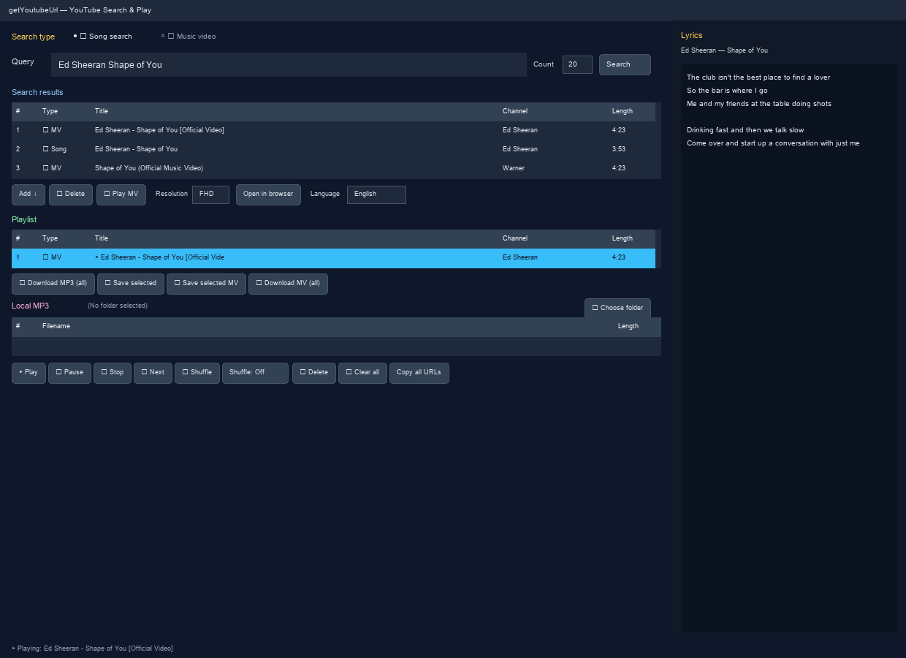

# getYoutubeUrl User Manual (English)

A GUI app built with Python, tkinter, yt-dlp, and libVLC. Search YouTube, play songs, show lyrics, and download MP3/MV files — all in one window.  
No YouTube API key required.



---

## Table of Contents

1. [Install & Run](#install--run)
2. [Screen Layout](#screen-layout)
3. [Changing Language](#changing-language)
4. [Search](#search)
5. [Playlist & Playback](#playlist--playback)
6. [Music Videos (MV)](#music-videos-mv)
7. [Download MP3 / MV](#download-mp3--mv)
8. [Local MP3](#local-mp3)
9. [Lyrics Panel](#lyrics-panel)
10. [Keyboard Shortcuts](#keyboard-shortcuts)
11. [Troubleshooting](#troubleshooting)

---

## Install & Run

### macOS

```bash
cd getYoutubeUrl
./setup-mac.sh   # first time only
./run.sh
```

### Linux (Raspberry Pi, etc.)

```bash
cd getYoutubeUrl
python3 -m venv .venv
.venv/bin/pip install -r requirements.txt
sudo apt install -y python3-tk vlc ffmpeg
./run.sh
```

### Windows

1. Run `setup-windows.bat` (switches to manual install if winget is unavailable)
2. Run `run-windows.bat` to start the app

> **Requirements:** Internet, VLC; ffmpeg for MP3/MV saving

---

## Screen Layout

| Area | Description |
|------|-------------|
| Top | Search type (Song / MV), query, count, Search button |
| Search results | YouTube search result list |
| Playlist | Queued songs and MVs (accumulates across searches) |
| Download | MP3 / MV save buttons |
| Local MP3 | Load and play MP3 files from a folder |
| Playback controls | Play, pause, next, shuffle, etc. |
| Right panel | Lyrics |
| Bottom | Status messages |

---

## Changing Language

1. Click the **Language** combobox below the search results
2. Choose **日本語 / 中文 / 한국어 / English**

Display order: **日本語 → 中文 → 한국어 → English**

The **default language is Japanese**. Select **English** for an English UI.  
All menus, buttons, status text, and dialogs update immediately.

---

## Search

### Search Type

| Mode | Description |
|------|-------------|
| **🎵 Song search** | Prefer regular audio tracks (MV titles deprioritized) |
| **🎬 Music video** | Search with `query + official mv`, MV titles preferred |

### Steps

1. Enter a song or artist in **Query**
2. Set **Count** (1–200, default 20)
3. Click **Search** or press `Enter`

### Search Result Actions

| Action | Function |
|--------|----------|
| **Add ↓** | Add selection to playlist (skips duplicate URLs) |
| **🗑 Delete** | Remove from search results |
| **🎬 Play MV** | Play selection in MV popup |
| **Resolution** | Max MV play/save resolution (HD / FHD / QHD / 2K / 4K) |
| **Open in browser** | Open in default web browser |
| **Double-click** | Song → add to list / MV → play MV |

---

## Playlist & Playback

Use **Add ↓** to build a queue with **unlimited** tracks from multiple searches.

| Button | Function |
|--------|----------|
| **▶ Play** | Play selection (🎵 audio / 🎬 MV popup) |
| **⏸ Pause** | Toggle play / pause |
| **⏹ Stop** | Stop playback |
| **⏭ Next** | Next track (random when shuffle is on) |
| **🔀 Shuffle** | Enable shuffle and play a random track |
| **Shuffle: Off/On** | Toggle random next / auto-advance |
| **🗑 Delete** | Remove selected item |
| **🗑 Clear all** | Empty entire playlist |
| **Copy all URLs** | Copy playlist URLs to clipboard |

The row marked with **▶** is currently playing.

---

## Music Videos (MV)

MVs play in a **separate popup** (initial size 800×600).

| Item | Details |
|------|---------|
| Resolution | Choose HD–4K next to search results (default FHD) |
| Fullscreen | **F11** or double-click video |
| Close | **Esc** (exits fullscreen first if active) |
| Note | High resolutions use ffmpeg to merge video + audio |

Main-window audio stops automatically while an MV plays.

---

## Download MP3 / MV

| Button | Function |
|--------|----------|
| **⬇ MP3 download (all)** | Save entire playlist as MP3 (192 kbps) |
| **⬇ Save selected song** | Save one selected track as MP3 |
| **⬇ Save selected MV** | Save selected MV as MP4 (chosen resolution) |
| **⬇ MV download (all)** | Batch-save all MVs in playlist |

A folder picker appears; progress shows in the status bar.

---

## Local MP3

1. Click **📁 Pick folder** to choose an MP3 directory
2. Select a file and **▶ Play MP3** or double-click
3. **Add all** puts every file into the playlist

Local tracks appear as **💾 Local**.

---

## Lyrics Panel

The **Lyrics** panel on the right shows lyrics for the current track (via `syncedlyrics`).

- Fetched automatically when playback starts
- Shows “Lyrics not found.” if unavailable
- Lyrics disabled if `syncedlyrics` is not installed

---

## Keyboard Shortcuts

| Key | Action | Scope |
|-----|--------|-------|
| `Enter` | Run search | Main window |
| `F11` | Toggle fullscreen | MV popup |
| `Esc` | Exit fullscreen / close popup | MV popup |

---

## Troubleshooting

| Issue | Fix |
|-------|-----|
| Search fails | `.venv/bin/pip install -U yt-dlp` |
| Playback fails | Verify VLC is installed |
| MP3/MV save fails | Install ffmpeg |
| No lyrics | `pip install syncedlyrics` |
| Some videos fail | Region or YouTube restrictions |

**GitHub:** [https://github.com/xiger78/getYoutubeUrl](https://github.com/xiger78/getYoutubeUrl)

---

## Manuals in Other Languages

- [日本語](manual_ja.md)
- [中文](manual_zh.md)
- [한국어](manual_ko.md)
