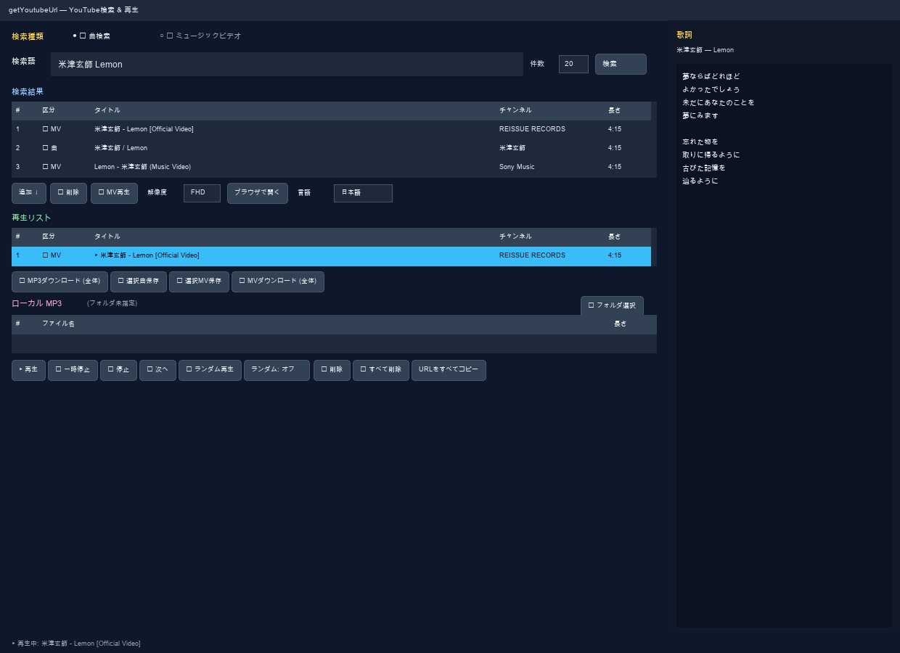

# getYoutubeUrl — YouTube 検索 · 再生 · MP3 保存

Python3 + tkinter + yt-dlp + libVLC で作った GUI プログラムです。  
曲名で YouTube を検索し、**再生リスト**に入れて **再生**、**歌詞表示**、**MP3·MV ダウンロード**、**ローカル MP3 再生**、**KAR MIDI 生成**まで一つのウィンドウで処理します。  
**曲検索**と **ミュージックビデオ検索**を選べ、MV は **800×600 ポップアップ**で選択した解像度（HD〜4K）で再生します。  
（YouTube API キー不要 · **既定 UI 言語: 日本語**）



---

## 目次

- [主要機能](#主要機能)
- [開発環境](#開発環境)
- [依存パッケージ](#依存パッケージ)
- [インストールと実行](#インストールと実行)
- [言語の変更](#言語の変更)
- [画面構成とボタン](#画面構成とボタン)
- [ショートカットキー](#ショートカットキー)
- [プロジェクト構成](#プロジェクト構成)
- [動作の仕組み](#動作の仕組み)
- [変更履歴](#変更履歴)
- [トラブルシューティング](#トラブルシューティング)
- [その他のコマンド](#その他のコマンド)
- [他言語マニュアル](#他言語マニュアル)

---

## 主要機能

- **🎵 曲検索** / **🎬 ミュージックビデオ** 検索モード（既定 20 件、最大 200 件）
- 検索結果·再生リストに **区分** 表示（`🎵 曲` / `🎬 MV` / `💾 ローカル`）
- 検索結果を再生リストに **無制限に蓄積**（複数回検索可、URL 重複防止）
- **曲**: メインウィンドウで libVLC オーディオストリーミング再生
- **MV**: 別 **ポップアップ**（初期 800×600）で HD〜4K 再生、F11 全画面
- 右パネル **歌詞** 表示（syncedlyrics）
- 再生リスト **MP3（192kbps）一括·選択保存**
- 再生リスト **MV MP4 一括·選択保存**（解像度選択可）
- **MP3 保存フォルダ内の全曲** から **KAR MIDI** 一括生成
- **ローカル MP3 フォルダ** 読み込み·再生（サブフォルダ含む）
- **UI 多言語**: 日本語 · 中文 · 한국어 · English
- **ランダム再生**、曲終了後の自動次曲
- **Linux / macOS / Windows** 用インストール·実行スクリプト
- 検索·再生·歌詞·ダウンロード·MV 読み込みは **バックグラウンドスレッド**（GUI フリーズ防止）

---

## 開発環境

### Raspberry Pi（基本開発·テスト環境）

| 項目 | 内容 |
|------|------|
| 機器 | Raspberry Pi (aarch64 / arm64) |
| OS | Debian GNU/Linux 13 (trixie) |
| デスクトップ | Wayland (labwc) + XWayland |
| Python | 3.13.5 |
| GUI | tkinter (`python3-tk`) |
| メディア | libVLC 3.0.23 "Vetinari" |
| 仮想環境 | `.venv/` |
| 初期ウィンドウ | 1240×900（最小 1000×780） |

> tkinter は XWayland ディスプレイ（`:0`）を使用。`run.sh` が `DISPLAY`·`XAUTHORITY` を自動設定します。

### macOS / Windows

| OS | Python | VLC | ffmpeg | インストール |
|----|--------|-----|--------|--------------|
| macOS | uv + Python 3.11 | `~/Applications/VLC.app` | `~/.local/bin/ffmpeg` | `setup-mac.sh` |
| Windows | Python 3.12 | VideoLAN VLC | `%LOCALAPPDATA%\getYoutubeUrl\bin` | `setup-windows.bat` 等 |

---

## 依存パッケージ

### システムパッケージ（apt 例）

| パッケージ | 用途 |
|------------|------|
| `python3` | ランタイム |
| `python3-tk` | tkinter GUI |
| `libvlc5` / `vlc-bin` | libVLC 再生 |
| `ffmpeg` | MP3/MV 変換·結合 |

### Python パッケージ（`.venv`）

| パッケージ | 用途 |
|------------|------|
| `yt-dlp` | YouTube 検索·ストリーム·ダウンロード |
| `python-vlc` | libVLC Python バインディング |
| `syncedlyrics` | 歌詞検索 |
| `mido` · `numpy` | KAR MIDI 生成（任意） |

> `syncedlyrics` がなくても歌詞以外は動作。`mido`·`numpy` がないと KAR ボタンはエラー表示。

---

## インストールと実行

### Linux（Raspberry Pi 等）

```bash
cd getYoutubeUrl
sudo bash setup-debian.sh          # 推奨（apt + .venv）
# または
python3 -m venv .venv
.venv/bin/pip install -U pip -r requirements.txt
sudo apt install -y python3-tk vlc ffmpeg

./run.sh
```

直接実行:

```bash
DISPLAY=:0 ./.venv/bin/python getYoutubeUrl.py
```

バックグラウンド（SSH 等）:

```bash
DISPLAY=:0 XAUTHORITY=$HOME/.Xauthority nohup ./run.sh >> /tmp/getYoutubeUrl.log 2>&1 &
pkill -f getYoutubeUrl.py   # 終了
```

### macOS

```bash
cd getYoutubeUrl
./setup-mac.sh
./run.sh
```

### Windows

| スクリプト | 用途 |
|------------|------|
| `setup-windows.bat` | winget 構築（なければ manual へ自動切替） |
| `setup-windows-manual.bat` | 手動インストール |
| `run-windows.bat` | 実行 |
| `fix-run-windows.bat` | 実行失敗時の診断·復旧 |

```text
1. setup-windows.bat をダブルクリック
2. run-windows.bat をダブルクリック
```

> `.bat` は ASCII + CRLF。実処理は `.ps1` が担当。インターネット接続が必要です。

---

## 言語の変更

検索結果下の **「言語」** コンボボックスから選択:

**日本語 → 中文 → 한국어 → English**（既定: **日本語**）

---

## 画面構成とボタン

左（検索·リスト·操作）+ 右（歌詞 320px）。下に **状態行**。

### 上部 — 検索

| UI | 機能 |
|----|------|
| **🎵 曲検索** | 通常曲優先（MV タイトルは後回し） |
| **🎬 ミュージックビデオ** | `検索語 + official mv`、MV 優先 |
| **検索語** | 曲名·アーティスト |
| **件数** | 1〜200（既定 20） |
| **検索** | バックグラウンド検索（`Enter` 同様） |

### 検索結果

| 列 | 説明 |
|----|------|
| # · 区分 · タイトル · チャンネル · 長さ | |

| ボタン / 操作 | 機能 |
|---------------|------|
| **追加 ↓** | 再生リストに追加（URL 重複はスキップ） |
| **🎬 MV再生** | MV ポップアップで再生 |
| **解像度** | MV 再生·保存の最大解像度（HD / FHD / QHD / 2K / 4K） |
| **ブラウザで開く** | 既定ブラウザで YouTube を開く |
| **言語** | UI 言語切替 |
| **ダブルクリック** | 曲 → 追加 / MV → MV 再生 |

### 再生リスト

| 列 | 説明 |
|----|------|
| # · 区分 · タイトル · チャンネル · 長さ | `▶` = 再生中 |

| ボタン（左から） | 機能 |
|------------------|------|
| **⬇ MP3ダウンロード (全体)** | リスト全曲を MP3（192kbps）保存 |
| **⬇ ダウンロード(MP3)** | 選択 1 曲を MP3 保存 |
| **⬇ MVダウンロード (全体)** | リスト内全 MV を MP4 保存 |
| **⬇ ダウンロード(MV)** | 選択 MV を MP4 保存 |
| **全曲 MIDIファイル作成** | **MP3 保存時に指定したフォルダ**内の全 `.mp3` から `.kar` 生成 |
| **🗑 すべて削除** | **再生リストのみ** 全削除 |

保存時はフォルダ選択。状態行に進捗表示。**ffmpeg** が必要（MP3·MV·KAR 共通）。

**ダブルクリック**: 曲 → 音声再生 / MV → ポップアップ。

### ローカル MP3

| UI | 機能 |
|----|------|
| **📁 フォルダ選択** | PC 内 MP3 フォルダ指定 |
| **🔄** | 再スキャン |
| 一覧 | `.mp3` `.m4a` `.flac` `.ogg` `.wav`（サブフォルダ含む） |
| **ダブルクリック** | ローカル MP3 再生 |

### 再生コントロール（1 行）

| ボタン | 機能 |
|--------|------|
| **▶ 再生** | 再生リスト選択 → なければローカル MP3 |
| **🗑 削除** | 選択項目をリストまたは MP3 一覧から削除 |
| **🗑 すべて削除** | フォーカスに応じ MP3 一覧または再生リストを全削除 |
| **🔀 ランダム再生** | ランダム ON で即再生 |
| **ランダム: オフ/オン** | 次曲·自動次曲のランダム切替 |
| **URLをすべてコピー** | 再生リスト URL をクリップボードへ |

### 右 — 歌詞パネル

再生中の曲の歌詞を `syncedlyrics` で表示（スクロール可）。

### MV ポップアップ

| 項目 | 内容 |
|------|------|
| 初期サイズ | 800×600（最小 640×480） |
| 解像度 | 検索結果横の **解像度** で選択（ffmpeg で映像+音声結合） |
| **F11** / 映像ダブルクリック | 全画面 |
| **Esc** | 全画面解除または閉じる |
| 自動 | MV 再生中はメイン音声停止 |

---

## ショートカットキー

| キー | 動作 | 対象 |
|------|------|------|
| `Enter` | 検索 | メイン |
| `F11` | 全画面 | MV ポップアップ |
| `Esc` | 全画面解除 / 閉じる | MV ポップアップ |

---

## プロジェクト構成

| ファイル / フォルダ | 説明 |
|---------------------|------|
| `getYoutubeUrl.py` | 本体（tkinter GUI） |
| `i18n.py` | UI 多言語文字列 |
| `kar_maker.py` | MP3 → KAR MIDI 変換 |
| `requirements.txt` | Python 依存関係 |
| `run.sh` | Linux/macOS 実行 |
| `setup-mac.sh` | macOS 環境構築 |
| `setup-debian.sh` | Debian/Raspberry Pi 環境構築 |
| `setup-windows*.bat/ps1` | Windows 環境構築 |
| `run-windows*.bat/ps1` | Windows 実行 |
| `fix-run-windows*.bat/ps1` | Windows 実行復旧 |
| `docs/manual_*.md` | 言語別ユーザーマニュアル |
| `docs/screenshots/` | マニュアル用スクリーンショット |
| `scripts/render_manual_screenshots.py` | スクリーンショット描画 |
| `scripts/capture_manual_screenshots.py` | スクリーンショットキャプチャ |
| `.venv/` | 仮想環境 |

---

## 動作の仕組み

### 検索

- **曲モード:** `ytsearch{N}:検索語` — MV タイトル優先除外
- **MV モード:** `ytsearch{N}:検索語 official mv` — MV 優先
- `extract_flat` でメタデータのみ取得

### 再生リスト

- メモリ上 `list[dict]`、曲数無制限、URL 重複防止

### 再生（曲）

1. `yt-dlp` でオーディオ URL 取得
2. libVLC でストリーミング

### 再生（MV）

1. `MvPlayerWindow` ポップアップ
2. 選択解像度以下で yt-dlp + ffmpeg 結合
3. VLC を `video_panel` に埋め込み

### 歌詞

- `syncedlyrics.search()` をバックグラウンド実行

### MP3 保存

- yt-dlp + FFmpegExtractAudio → mp3 192kbps
- 保存フォルダは **全曲 MIDI 作成** でも参照

### MV 保存

- 再生リストの `media_type == "mv"` のみ
- 選択解像度以下の MP4

### KAR MIDI

- MP3 ダウンロードで指定したフォルダ内の `.mp3` を順次 `.kar` に変換（同フォルダに出力）

### ランダム再生

- `shuffle=True` 時、次曲·曲終了後自動送りがランダム

---

## 変更履歴

| 版 | 内容 |
|----|------|
| v1 | YouTube 検索上位 10 + URL 表示 |
| v2 | 再生リスト·VLC ストリーミング |
| v3 | 複数検索蓄積·ランダム·削除 |
| v4 | 歌詞パネル |
| v5 | MP3 一括保存 |
| v6 | 検索件数 1〜200·選択曲 MP3 保存 |
| v7 | ウィンドウ 1240×820 |
| v8 | 曲/MV 検索区分·MV ポップアップ |
| v9 | MV 800×600·Full HD·F11/Esc |
| v10 | Windows スクリプト |
| v11 | Windows manual·fix-run |
| v12 | MV MP4 一括·選択保存 |
| v13 | Windows bat/ps1 分離 |
| v14 | UI 多言語（ja/zh/ko/en）·解像度選択·ローカル MP3 |
| v15 | MP3 保存フォルダから全曲 KAR MIDI·UI ボタン整理 |

---

## トラブルシューティング

- **GitHub:** [https://github.com/xiger78/getYoutubeUrl](https://github.com/xiger78/getYoutubeUrl)
- 地域·YouTube ポリシーにより一部動画は失敗することがあります
- 検索不可 → `.venv/bin/pip install -U yt-dlp`
- 再生不可 → VLC インストール確認
- MP3/MV/KAR 失敗 → **ffmpeg** 確認
- KAR 不可 → `pip install mido numpy`
- 歌詞なし → `pip install syncedlyrics`
- ローカル MP3 非表示 → 拡張子·🔄 再スキャン
- Windows インストール → `setup-windows.bat` または `setup-windows-manual.bat`
- Windows 実行 → `fix-run-windows.bat`
- Linux 韓国語入力 → `setup-debian.sh --with-korean`（fcitx5）

---

## その他のコマンド

プロジェクトルートで実行。

### リポジトリ

```bash
git clone https://github.com/xiger78/getYoutubeUrl.git
cd getYoutubeUrl
```

### macOS

```bash
./setup-mac.sh
./run.sh
VLC_APP=/Applications/VLC.app ./run.sh
```

### Linux

```bash
sudo bash setup-debian.sh
sudo bash setup-debian.sh --with-korean
bash setup-debian.sh --venv-only
./run.sh
pkill -f getYoutubeUrl.py
```

### Windows

```powershell
.\run-windows.ps1
```

### マニュアル用スクリーンショット

```bash
.venv/bin/python scripts/render_manual_screenshots.py
./run.sh scripts/capture_manual_screenshots.py   # macOS·画面収録権限
```

### パッケージ更新

```bash
.venv/bin/pip install -U yt-dlp
.venv/bin/pip install -U pip -r requirements.txt
uv pip install -r requirements.txt
```

---

## 他言語マニュアル

- [中文](manual_zh.md) · [한국어](manual_ko.md) · [English](manual_en.md)
