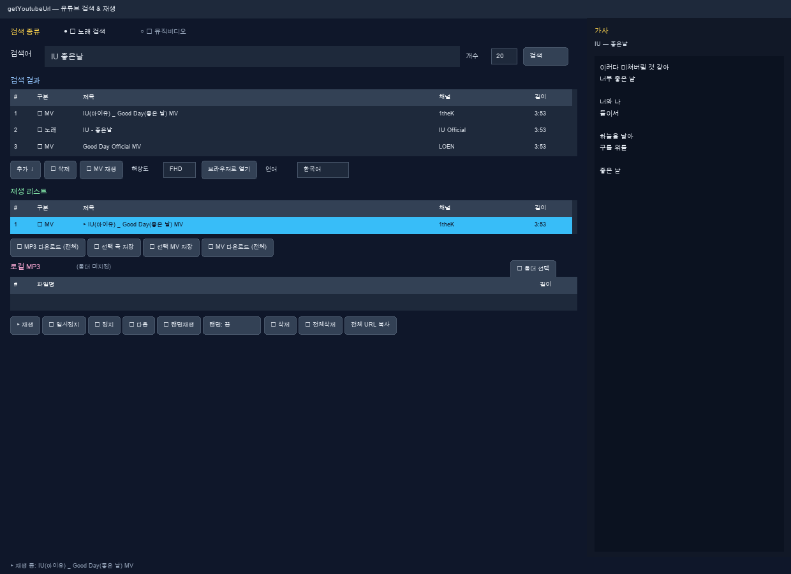

# getYoutubeUrl 사용자 매뉴얼（한국어）

Python3 + tkinter + yt-dlp + libVLC 로 만든 GUI 프로그램입니다.  
유튜브 검색, 재생, 가사 표시, MP3·MV 다운로드를 한 창에서 처리합니다.  
유튜브 API 키는 필요 없습니다.



---

## 목차

1. [설치 및 실행](#설치-및-실행)
2. [화면 구성](#화면-구성)
3. [언어 변경](#언어-변경)
4. [검색](#검색)
5. [재생 리스트와 재생](#재생-리스트와-재생)
6. [뮤직비디오(MV)](#뮤직비디오mv)
7. [MP3 / MV 다운로드](#mp3--mv-다운로드)
8. [로컬 MP3](#로컬-mp3)
9. [가사 패널](#가사-패널)
10. [단축키](#단축키)
11. [문제 해결](#문제-해결)

---

## 설치 및 실행

### macOS

```bash
cd getYoutubeUrl
./setup-mac.sh   # 최초 1회
./run.sh
```

### Linux (Raspberry Pi 등)

```bash
cd getYoutubeUrl
python3 -m venv .venv
.venv/bin/pip install -r requirements.txt
sudo apt install -y python3-tk vlc ffmpeg
./run.sh
```

### Windows

1. `setup-windows.bat` 실행 (winget 없으면 수동 설치로 자동 전환)
2. `run-windows.bat` 으로 실행

> **필요:** 인터넷 연결, VLC, MP3/MV 저장 시 ffmpeg

---

## 화면 구성

| 영역 | 설명 |
|------|------|
| 상단 | 검색 종류(노래/MV), 검색어, 개수, 검색 버튼 |
| 검색 결과 | 유튜브 검색 결과 목록 |
| 재생 리스트 | 재생 대기 곡·MV (여러 번 검색 누적 가능) |
| 다운로드 | MP3/MV 저장 버튼 |
| 로컬 MP3 | PC 폴더의 MP3 불러와 재생 |
| 재생 컨트롤 | 재생·일시정지·다음·랜덤 등 |
| 오른쪽 패널 | 가사 표시 |
| 하단 | 상태 메시지 |

---

## 언어 변경

1. 검색 결과 아래 **「언어」** 콤보박스 클릭
2. **日本語 / 中文 / 한국어 / English** 중 선택

표시 순서: **日本語 → 中文 → 한국어 → English**

**기본 언어는 일본어**입니다. 한국어 UI를 쓰려면 **한국어**를 선택하세요.  
메뉴·버튼·상태 메시지·대화상자가 모두 선택한 언어로 바뀝니다.

---

## 검색

### 검색 종류

| 모드 | 설명 |
|------|------|
| **🎵 노래 검색** | 일반 곡 위주 검색 (MV 제목은 후순위) |
| **🎬 뮤직비디오** | `검색어 + official mv` 로 MV 우선 검색 |

### 사용 방법

1. **검색어**에 곡명·가수명 입력
2. **개수**로 결과 수 지정 (1~200, 기본 20)
3. **검색** 클릭 또는 `Enter`

### 검색 결과 조작

| 동작 | 기능 |
|------|------|
| **추가 ↓** | 선택 항목을 재생 리스트에 추가 (URL 중복 시 건너뜀) |
| **🗑 삭제** | 검색 결과에서 선택 항목 삭제 |
| **🎬 MV 재생** | 선택 항목을 MV 팝업에서 재생 |
| **해상도** | MV 재생·저장 최대 해상도 (HD / FHD / QHD / 2K / 4K) |
| **브라우저로 열기** | 기본 브라우저에서 유튜브 열기 |
| **더블클릭** | 노래 → 리스트 추가 / MV → MV 재생 |

---

## 재생 리스트와 재생

**추가 ↓** 로 곡을 모아 순서대로 재생할 수 있습니다.  
리스트는 **곡 수 제한 없이** 여러 번 검색한 결과를 섞을 수 있습니다.

| 버튼 | 기능 |
|------|------|
| **▶ 재생** | 선택 곡 재생 (🎵 오디오 / 🎬 MV 팝업) |
| **⏸ 일시정지** | 재생 ↔ 일시정지 |
| **⏹ 정지** | 정지 |
| **⏭ 다음** | 다음 곡 (랜덤 켬이면 무작위) |
| **🔀 랜덤재생** | 랜덤 켜고 즉시 무작위 재생 |
| **랜덤: 끔/켬** | 다음 곡·자동 다음 곡 랜덤 여부 |
| **🗑 삭제** | 선택 곡 리스트에서 제거 |
| **🗑 전체삭제** | 리스트 전체 비우기 |
| **전체 URL 복사** | 리스트 URL 클립보드 복사 |

**▶** 표시가 있는 행이 현재 재생 중인 곡입니다.

---

## 뮤직비디오(MV)

MV는 **별도 팝업 창**(초기 800×600)에서 재생됩니다.

| 항목 | 내용 |
|------|------|
| 해상도 | 검색 결과 옆 **해상도** 에서 HD~4K 선택 (기본 FHD) |
| 전체화면 | **F11** 또는 영상 더블클릭 |
| 닫기 | **Esc** (전체화면이면 먼저 해제) |
| 참고 | 고해상도는 ffmpeg 로 영상+음성 병합 후 재생 |

MV 재생 중 메인 창 오디오는 자동 정지됩니다.

---

## MP3 / MV 다운로드

| 버튼 | 기능 |
|------|------|
| **⬇ MP3 다운로드 (전체)** | 재생 리스트 전체를 MP3(192kbps)로 저장 |
| **⬇ 선택 곡 저장** | 선택한 한 곡만 MP3 저장 |
| **⬇ 선택 MV 저장** | 선택 MV를 MP4로 저장 (선택 해상도) |
| **⬇ MV 다운로드 (전체)** | 리스트의 모든 MV 일괄 MP4 저장 |

저장 시 폴더 선택 창이 뜨고, 하단 상태줄에 진행 상황이 표시됩니다.

---

## 로컬 MP3

1. **📁 폴더 선택** 으로 MP3 폴더 지정
2. 목록에서 곡 선택 후 **▶ MP3 재생** 또는 더블클릭
3. **전체 추가** 로 재생 리스트에 일괄 추가

로컬 곡은 **💾 로컬** 로 표시됩니다.

---

## 가사 패널

오른쪽 **가사** 패널에 재생 중인 곡의 가사를 표시합니다 (`syncedlyrics`).

- 재생 시작 후 자동 검색
- 없으면 「가사를 찾지 못했습니다.」 표시
- `syncedlyrics` 미설치 시 가사 기능만 비활성

---

## 단축키

| 키 | 동작 | 적용 |
|----|------|------|
| `Enter` | 검색 실행 | 메인 창 |
| `F11` | 전체화면 토글 | MV 팝업 |
| `Esc` | 전체화면 해제 / 팝업 닫기 | MV 팝업 |

---

## 문제 해결

| 증상 | 해결 |
|------|------|
| 검색 안 됨 | `.venv/bin/pip install -U yt-dlp` |
| 재생 안 됨 | VLC 설치 확인 |
| MP3/MV 저장 실패 | ffmpeg 설치 |
| 가사 없음 | `pip install syncedlyrics` |
| 일부 영상 실패 | 지역·유튜브 정책 제한 가능 |

**GitHub:** [https://github.com/xiger78/getYoutubeUrl](https://github.com/xiger78/getYoutubeUrl)

---

## 다른 언어 매뉴얼

- [日本語](manual_ja.md)
- [中文](manual_zh.md)
- [English](manual_en.md)
