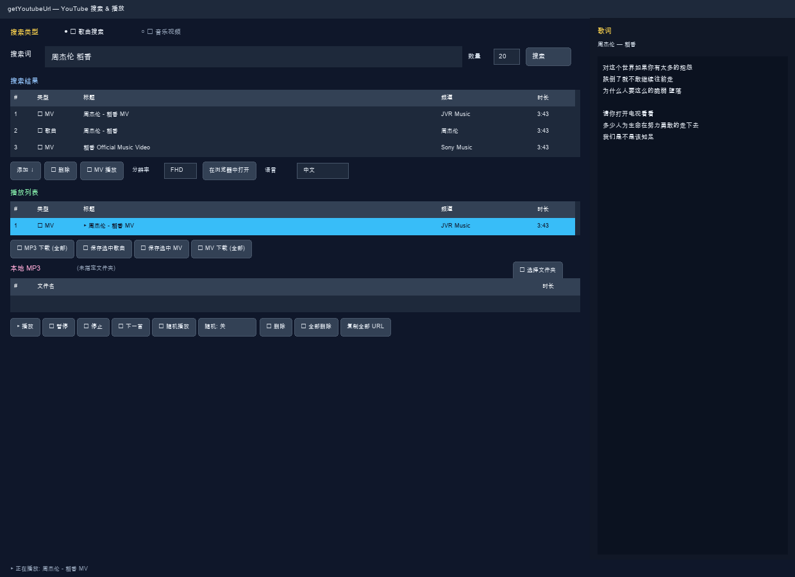

# getYoutubeUrl 用户手册（中文）

基于 Python + tkinter + yt-dlp + libVLC 的 GUI 程序。  
在同一窗口内完成 YouTube 搜索、播放、歌词、MP3/MV 下载和本地 MP3 播放。无需 API 密钥。



---

## 目录

1. [安装与运行](#安装与运行)
2. [界面说明](#界面说明)
3. [切换语言](#切换语言)
4. [搜索](#搜索)
5. [播放列表](#播放列表)
6. [音乐视频（MV）](#音乐视频mv)
7. [本地 MP3](#本地-mp3)
8. [播放控制](#播放控制)
9. [歌词面板](#歌词面板)
10. [快捷键](#快捷键)
11. [故障排除](#故障排除)
12. [其他命令](#其他命令)

---

## 安装与运行

```bash
# macOS
./setup-mac.sh && ./run.sh

# Linux
python3 -m venv .venv && .venv/bin/pip install -r requirements.txt
sudo apt install -y python3-tk vlc ffmpeg && ./run.sh

# Windows: setup-windows.bat → run-windows.bat
```

---

## 界面说明

| 区域 | 说明 |
|------|------|
| 顶部 | 搜索类型、搜索词、数量、搜索 |
| 搜索结果 | YouTube 结果列表 |
| 结果按钮 | 添加、MV 播放、分辨率、浏览器、语言 |
| 播放列表 | 待播放歌曲/MV |
| 列表按钮 | MP3/MV 下载、MIDI 生成、全部删除 |
| 本地 MP3 | 文件夹 MP3 加载 |
| 播放控制 | 播放、删除、全部删除、随机、复制 URL |
| 右侧 | 歌词 |
| 底部 | 状态栏 |

---

## 切换语言

在 **语言** 下拉框中选择：**日本語 / 中文 / 한국어 / English**

- 默认：日语
- 顺序：日本語 → 中文 → 한국어 → English

---

## 搜索

| 模式 | 说明 |
|------|------|
| **🎵 歌曲搜索** | 优先普通歌曲 |
| **🎬 音乐视频** | 优先 MV |

按 **搜索** 或 `Enter` 执行。

| 操作 | 功能 |
|------|------|
| **添加 ↓** | 加入播放列表 |
| **🎬 MV播放** | 弹窗播放 MV |
| **分辨率** | HD~4K |
| **在浏览器中打开** | 默认浏览器打开 |
| **双击** | 歌曲→添加 / MV→播放 |

---

## 播放列表

### 按钮（从左到右）

| 按钮 | 功能 |
|------|------|
| **⬇ MP3 下载 (全部)** | 整列表 MP3 保存 |
| **⬇ 下载(MP3)** | 选中一首 MP3 |
| **⬇ MV 下载 (全部)** | 全部 MV MP4 |
| **⬇ 下载(MV)** | 选中 MV MP4 |
| **选中歌曲生成 MIDI** | KAR MIDI |
| **🗑 全部删除** | **仅清空播放列表** |

双击列表行可播放。

---

## 音乐视频（MV）

独立弹窗 800×600，**F11** 全屏，**Esc** 关闭。高分辨率通过 ffmpeg 合并。

---

## 本地 MP3

1. **📁 选择文件夹**，**🔄** 重新扫描
2. 含子文件夹的 `.mp3` `.m4a` `.flac` `.ogg` `.wav`
3. **双击** 播放

---

## 播放控制

本地 MP3 下方 **单行** 按钮：

| 按钮 | 功能 |
|------|------|
| **▶ 播放** | 播放列表优先，否则本地 MP3 |
| **🗑 删除** | 删除选中项 |
| **🗑 全部删除** | 根据焦点清空 MP3 或播放列表 |
| **🔀 随机播放** | 随机播放 |
| **随机: 关** | 切换随机模式 |
| **复制全部 URL** | 复制列表 URL |

---

## 歌词面板

播放后右侧显示歌词（`syncedlyrics`）。

---

## 快捷键

| 键 | 动作 |
|----|------|
| `Enter` | 搜索 |
| `F11` | MV 全屏 |
| `Esc` | 关闭 MV |

---

## 故障排除

| 问题 | 解决 |
|------|------|
| 无法搜索 | 更新 yt-dlp |
| 无法播放 | 检查 VLC |
| 保存失败 | 安装 ffmpeg |
| MP3 不显示 | 检查格式与文件夹，点 🔄 |

**GitHub:** [https://github.com/xiger78/getYoutubeUrl](https://github.com/xiger78/getYoutubeUrl)

---

## 其他命令

在项目根目录 `getYoutubeUrl/` 下执行。

### 克隆仓库

```bash
git clone https://github.com/xiger78/getYoutubeUrl.git
cd getYoutubeUrl
```

### macOS

| 命令 / 文件 | 说明 |
|-------------|------|
| `./setup-mac.sh` | 自动安装 uv、Python 3.11、VLC、ffmpeg、`.venv` |
| `./run.sh` | 运行程序（自动配置 VLC·ffmpeg PATH） |
| `VLC_APP=/Applications/VLC.app ./run.sh` | 指定 VLC 路径运行 |
| `.venv/bin/python getYoutubeUrl.py` | 直接运行（需 VLC 环境变量） |

```bash
VLC_MACOS="$HOME/Applications/VLC.app/Contents/MacOS"
export DYLD_LIBRARY_PATH="$VLC_MACOS/lib"
export VLC_PLUGIN_PATH="$VLC_MACOS/plugins"
export PATH="$HOME/.local/bin:$PATH"
./.venv/bin/python getYoutubeUrl.py
```

### Linux（Debian / 树莓派等）

| 命令 / 文件 | 说明 |
|-------------|------|
| `sudo bash setup-debian.sh` | 安装 apt 包 + `.venv` + pip |
| `bash setup-debian.sh --venv-only` | 仅 `.venv`·pip（无需 sudo） |
| `sudo bash setup-debian.sh --with-korean` | 安装 + fcitx5 韩文输入法 |
| `bash setup-debian.sh --help` | 查看选项 |
| `./run.sh` | 运行（含 `DISPLAY`、fcitx5 设置） |

```bash
python3 -m venv .venv
.venv/bin/pip install -U pip -r requirements.txt
sudo apt install -y python3-tk vlc ffmpeg

DISPLAY=:0 ./.venv/bin/python getYoutubeUrl.py

DISPLAY=:0 XAUTHORITY=$HOME/.Xauthority nohup ./run.sh >> /tmp/getYoutubeUrl.log 2>&1 &

pkill -f getYoutubeUrl.py
```

### Windows

| 文件 | 说明 |
|------|------|
| `setup-windows.bat` | winget 环境搭建（无 winget 则转 manual） |
| `setup-windows.ps1` | bat 对应的 PowerShell |
| `setup-windows-manual.bat` | 无 winget 手动安装 |
| `setup-windows-manual.ps1` | manual bat 的 PowerShell |
| `run-windows.bat` | 运行程序 |
| `run-windows.ps1` | 运行逻辑 |
| `fix-run-windows.bat` | 运行失败诊断与修复 |
| `fix-run-windows.ps1` | fix bat 的 PowerShell |

```text
1. 双击 setup-windows.bat（或 setup-windows-manual.bat）
2. 双击 run-windows.bat
   ※ 失败时运行 fix-run-windows.bat
```

```powershell
cd getYoutubeUrl
.\run-windows.ps1
```

### 手册与截图

| 命令 | 说明 |
|------|------|
| `.venv/bin/python scripts/render_manual_screenshots.py` | 生成各语言 UI 截图 → `docs/screenshots/` |
| `./run.sh scripts/capture_manual_screenshots.py` | macOS 真实窗口截图（需屏幕录制权限） |

```bash
uv pip install pillow
.venv/bin/pip install pillow
```

### 包更新与维护

```bash
.venv/bin/pip install -U yt-dlp
.venv/bin/pip install -U pip -r requirements.txt
.venv/bin/pip install syncedlyrics
uv pip install -r requirements.txt
```

Windows:

```powershell
.\.venv\Scripts\python.exe -m pip install -U yt-dlp
.\.venv\Scripts\python.exe -m pip install -r requirements.txt
```

### 主要文件

| 路径 | 说明 |
|------|------|
| `getYoutubeUrl.py` | 主程序 |
| `i18n.py` | 多语言 UI 文本 |
| `kar_maker.py` | KAR MIDI 生成 |
| `requirements.txt` | Python 依赖 |
| `docs/manual_*.md` | 各语言手册 |
| `docs/screenshots/` | 手册截图 |
| `scripts/render_manual_screenshots.py` | 截图渲染 |
| `scripts/capture_manual_screenshots.py` | 截图捕获 |
| `README.md` | 项目 README |

---

## 其他语言

- [日本語](manual_ja.md) · [한국어](manual_ko.md) · [English](manual_en.md)
